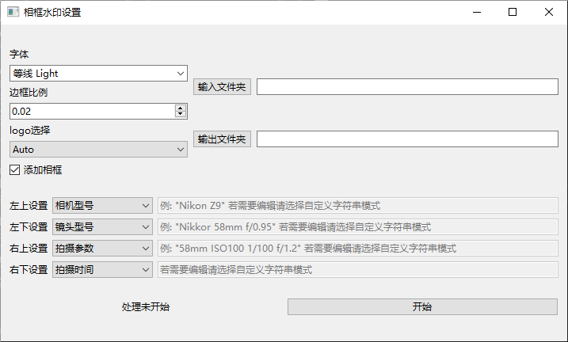

# photo_watermark

<font size=5>**纯C++与Qt实现的照片批量添加可自定义的水印的跨平台gui程序**</font>

## GUI参考


- 字体选择:  选择使用的字体，默认选择包内自带的```执行程序路径/font/MiSans Latin*```字体。~~对的，就是雷军字体~~
- 边框比例： 原始图像 * 边框比例 = 边框像素数。此值会作为计算内部边距的基准
- logo选择： 默认加载```执行程序路径/logos```文件夹内的所有图片, Auto时自动匹配。若想自定义logo, 请在logos文件夹内放入命名为```相机厂商.jpg```的文件
- 输入输出文件夹： 不解释了，输出文件夹不存在会尝试自动创建
- 添加相框： 左上右三边是否加上白边的相框
- 文字设置： 下边框的四角分别写什么, 除图上四种以外，还可选择无或自定义字符串

## 默认参数的效果


## 计划
- 更多的自定义功能
- 更好看的ui(如果有人能来帮我做界面才可能会有，我实在是不会设计)
- 跨平台未经测试

## 细节

1. logo选择为Auto时, 匹配规则为 ```忽略大小写的比较 exif.Make 与 logo文件名```
2. 

## 依赖与许可证
本项目使用[Apache-2.0 license](LICENSE)

本项目引用了[mayanklahiri/easyexif](https://github.com/mayanklahiri/easyexif)项目作为exif解析模块。请参阅其[license](https://github.com/mayanklahiri/easyexif/blob/master/LICENSE)

## 灵感来源
本项目灵感来源于[semi-utils](https://github.com/leslievan/semi-utils) , 主要是觉得python+命令行有点难用了，基于此做了些小小的工作
