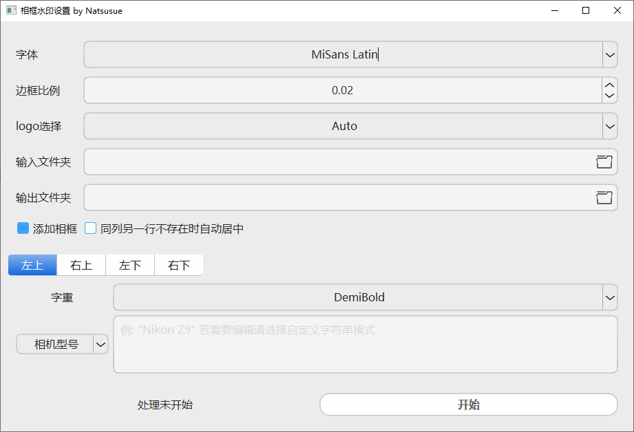
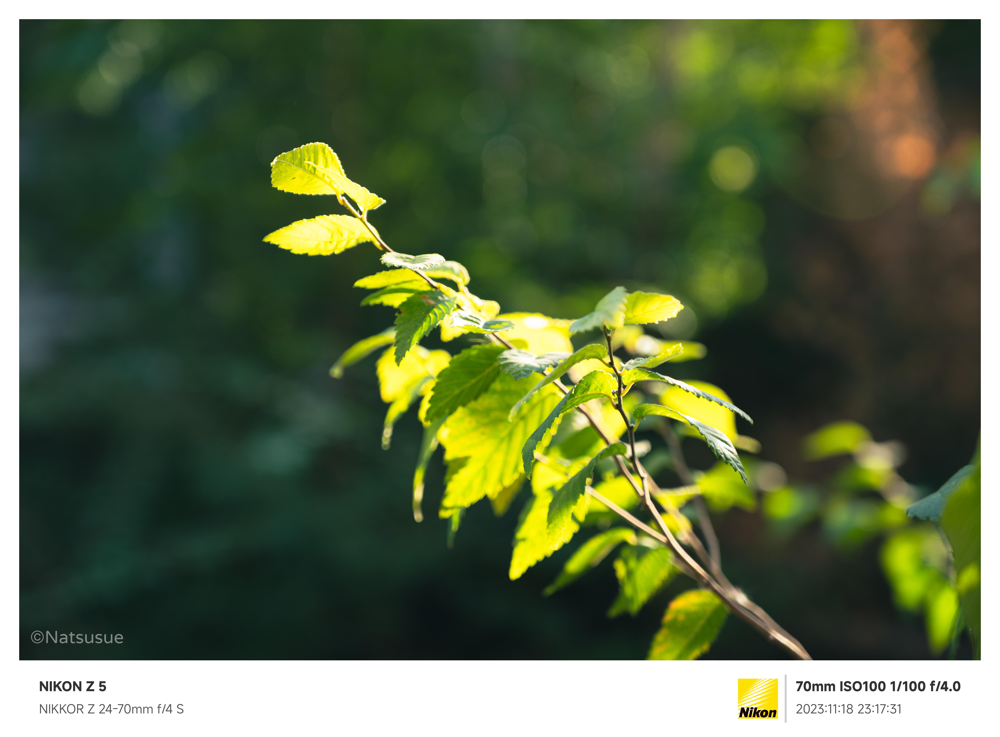

# photo_watermark

<font size=5>**纯C++与Qt实现的照片批量添加可自定义的水印的跨平台gui程序**</font>

支持平台
* Windows
* Linux
* MacOs

[](https://github.com/natsusue/photo_watermark/actions)
[](LICENSE)


## GUI参考



* 字体选择:  选择使用的字体，默认选择包内自带的```执行程序路径/font/MiSans Latin*```字体。~~对的，就是雷军字体~~
* 边框比例： 原始图像 * 边框比例 = 边框像素数。此值会作为计算内部边距的基准
* logo选择： 默认加载```执行程序路径/logos```文件夹内的所有图片, Auto时自动匹配。若想自定义logo, 请在logos文件夹内放入命名为```相机厂商.jpg```的文件 ```logo匹配规则: 忽略大小写的比较 exif.Make 与 logo文件名```
* 输入输出文件夹： 不解释了，输出文件夹不存在会尝试自动创建
* 添加相框： 左上右三边是否加上白边的相框
* 自动居中： 某侧只有某一个文字时，保持位置还是自动居中。(如左上选择无，左下正常，勾选后左下的文字将会自动居中，不然保持原位置)
* 文字设置
  * 字重: 文字粗细, 超过Black(900) 可以自行填写数字
  * 类型选择：下边框的四角分别写什么, 除图上四种以外，还可选择无或自定义字符串
    * 相机型号: exif中取得```0x0110 Model```
    * 镜头型号: exif中取得```0xa434 LensModel```
    * 拍摄参数: 焦距 ISO 快门速度 光圈
    * 拍摄时间: exif中取得```0x0132 ModifyDate```
    * 位置信息: exif中取得```0x8825 GPSInfo```
    * 自定义字符串: 以纯文本模式处理用户输入
    * HTML富文本: 以html富文本模式处理用户输入，推荐使用```<p>```和```<span>```标签

## 默认参数的效果



## 计划

* 更多的自定义功能
* 更多的样式或支持自定义样式
* 更好看的ui 感谢[paolidayi](https://github.com/paolidayi)重构了ui

## 依赖与许可证

本项目使用Apache许可[Apache-2.0 license](LICENSE)

本项目引用了[mayanklahiri/easyexif](https://github.com/mayanklahiri/easyexif)项目作为exif解析模块。请参阅其[license](https://github.com/mayanklahiri/easyexif/blob/master/LICENSE)

## 灵感来源

本项目灵感来源于[semi-utils](https://github.com/leslievan/semi-utils) , 主要是觉得python+命令行有点难用了，基于此做了些小小的工作
